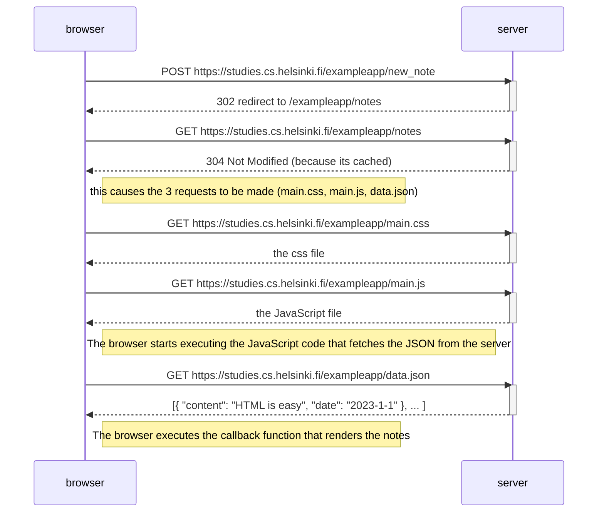
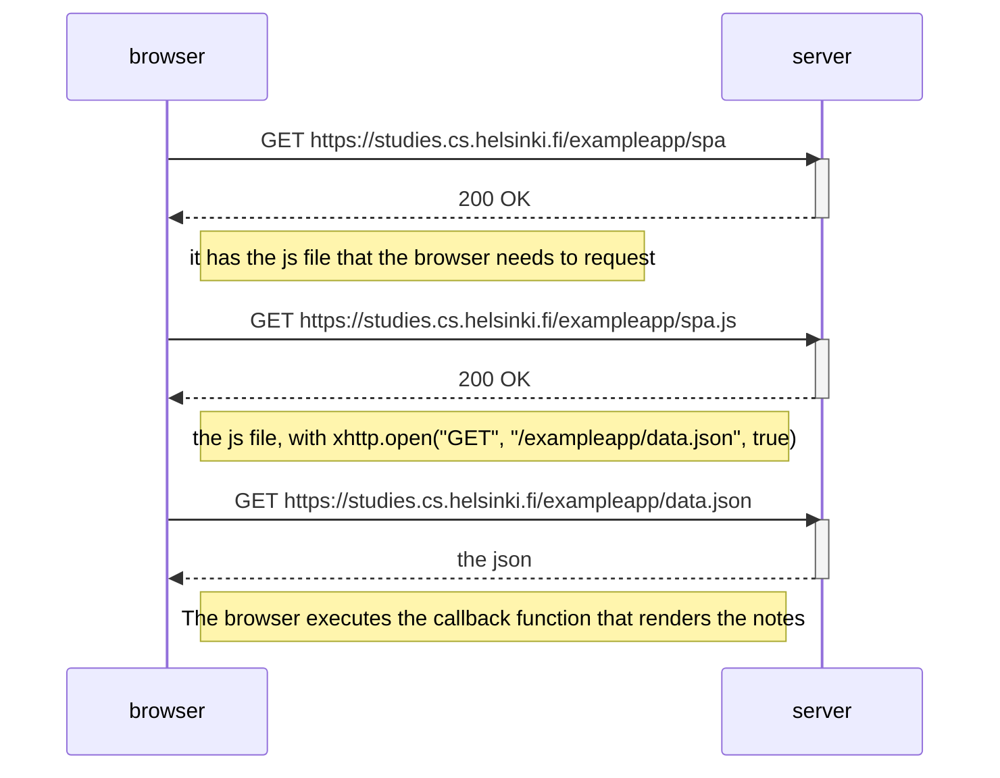
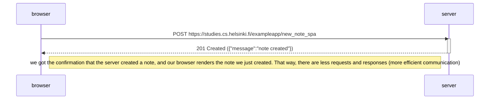

0.4

We've been shown the diagram for ACCESSING the not-spa webapp. This is the diagram representing CREATING a note in the not-spa webapp.

0.5
Diagram for ACCESSING the spa webapp. 

0.6

Diagram representing CREATING a note in the spa webapp.

